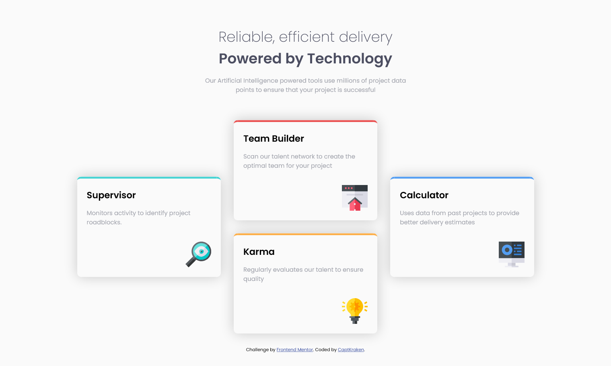

# Frontend Mentor - Four card feature section

This is a solution to the [Four card feature section challenge on Frontend Mentor](https://www.frontendmentor.io/challenges/four-card-feature-section-weK1eFYK). Frontend Mentor challenges help you improve your coding skills by building realistic projects.

## Table of contents

- [Overview](#overview)
  - [The challenge](#the-challenge)
  - [Screenshot](#screenshot)
  - [Links](#links)
- [My process](#my-process)
  - [Built with](#built-with)
- [Author](#author)

## Overview

This is the second thing i built with CSS grid on here. this was frustrating at first, but once i figured out how to do the layout, it was fun. i wanted to add some hover animation, but then i decided not to.

### The challenge

Your challenge is to build out this feature section and get it looking as close to the design as possible.

You can use any tools you like to help you complete the challenge. So if you've got something you'd like to practice, feel free to give it a go.

Your users should:

- View the optimal layout for the site depending on their device's screen size

### Screenshot

### Links

- Solution URL: [On Frontend Mentor](https://www.frontendmentor.io/solutions/fourcardfeaturesection-with-html-scss-grid-pctabletmobile-mIaXlnqYK)
- Live Site URL: [Live Demo](https://captkraken.github.io/four-card-feature-section)

## My process

Started out with HTML then went the desktop-first route. After that, started modifying things to fix the problems.

### Built with

- HTML5
- Sass
- CSS Grid

## Author

- Website - [My Github](https://github.com/CaptKraken)
- Frontend Mentor - [@CaptKraken](https://www.frontendmentor.io/profile/CaptKraken)
